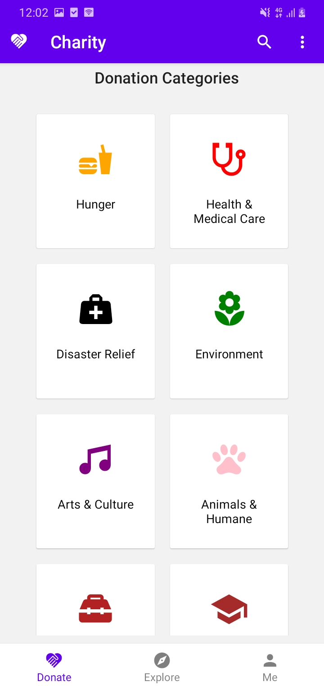
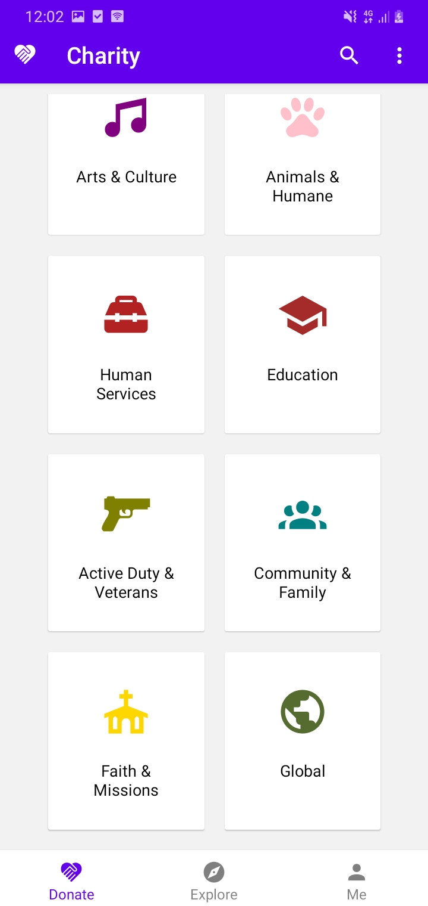
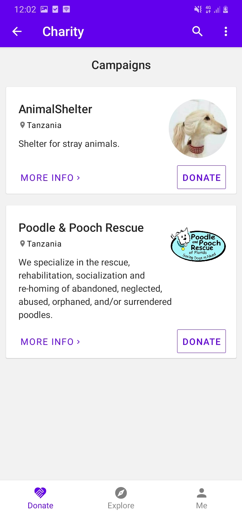
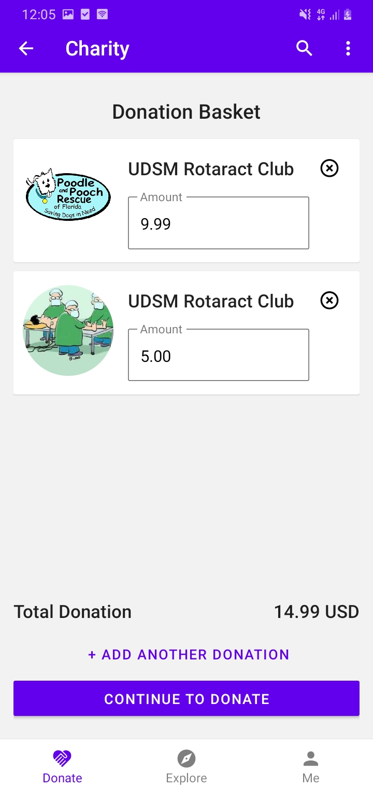
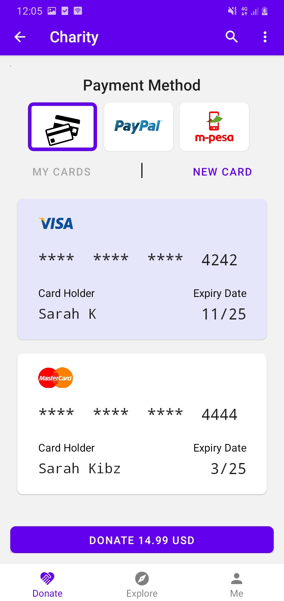
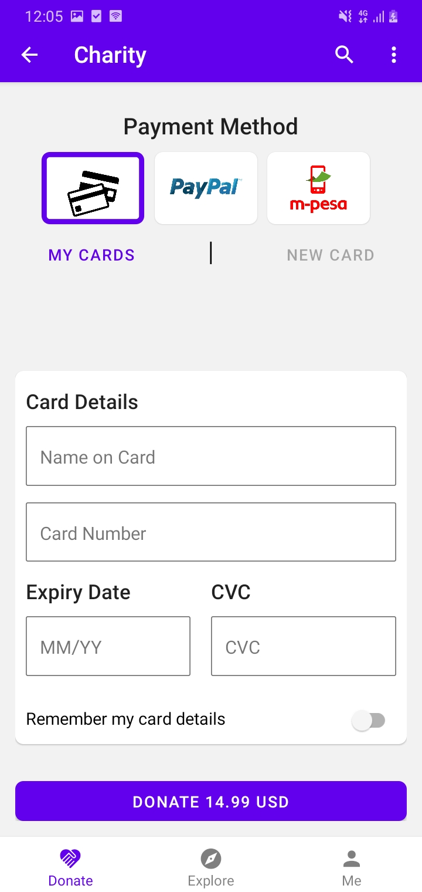
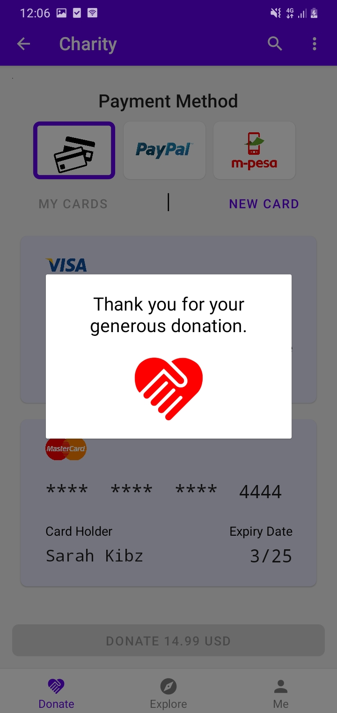
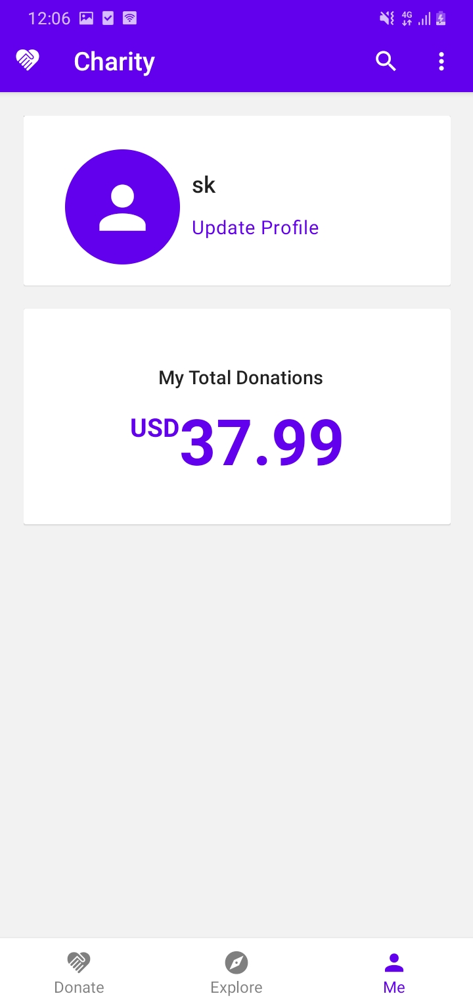

# Charity App

## Installation
1. Clone this repository (or download and extract the zip file)
2. Open a command prompt or terminal
3. Change to the directory that contains the project files
4. Run `npm install` to install all dependencies

## Usage
Run the code below to build and start the app in an emulator or device  
For android:  
`npm run android`  
For iOS: (hasn't been tested yet)  
`npm run ios`

## APK
[Download here](https://docs.google.com/uc?export=download&id=1s-YE1EdEFfBisF6QWWDM5JEULIuNNyEy)

Note: 
1. This is an MVP so some features aren't complete.
2. Application is in test mode so use test cards for making payments.
3. The app server goes to sleep when idle so it might take some time to load when you open the app.

Use the card numbers below with any valid date in the future for expiry date and  with any 3 digits for cvc  
Visa: `4242 4242 4242 4242` (no spaces)  
Mastercard: `5555 5555 5555 4444` (no spaces)

## Screenshots
    
    
    

